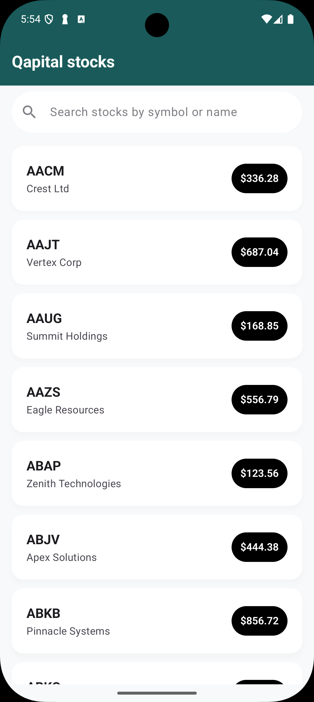
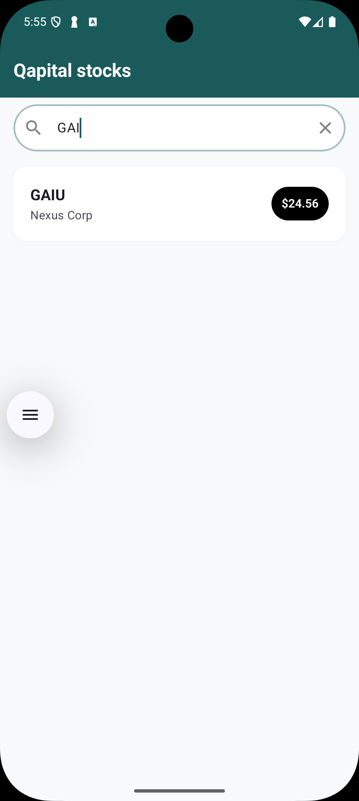
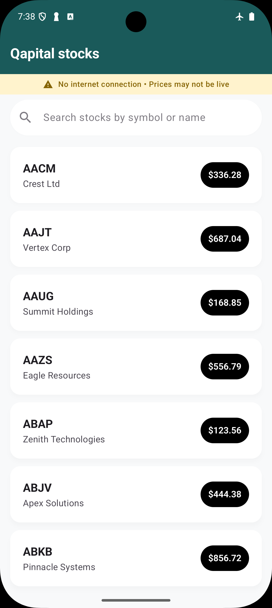

# Stock Search Android App

A modern Android application for searching stocks with real-time filtering, built with Clean Architecture and best practices.

## Features

- **Real-time Search**: Debounced search with 300ms delay for optimal performance
- **Offline Support**: SQLDelight caching with intelligent fallback mechanisms
- **Material 3 Design**: Modern UI with proper loading, error, and empty states
- **Comprehensive Testing**: Unit tests, integration tests, and UI tests
- **Production Ready**: Minified release builds with ProGuard obfuscation

## Screenshots

<div align="center">
  
  
  
</div>

_Left: Stock list with all available stocks | Center: Search results for "GAI" query | Right: Offline mode with cached data_

## Architecture

### Clean Architecture + MVVM

```
┌─────────────────────────────────────────────────────────────┐
│                    Presentation Layer                        │
│  ┌──────────────┐  ┌──────────────┐  ┌──────────────┐      │
│  │   Compose    │  │  ViewModel   │  │   UI State   │      │
│  │     UI       │  │   (MVVM)     │  │  Management  │      │
│  └──────────────┘  └──────────────┘  └──────────────┘      │
└─────────────────────────────────────────────────────────────┘
                               │
┌─────────────────────────────────────────────────────────────┐
│                     Domain Layer                             │
│  ┌──────────────┐  ┌──────────────┐  ┌──────────────┐      │
│  │  Use Cases   │  │  Repository  │  │    Models    │      │
│  │ (Business    │  │ Interfaces   │  │  (Domain)    │      │
│  │   Logic)     │  │              │  │              │      │
│  └──────────────┘  └──────────────┘  └──────────────┘      │
└─────────────────────────────────────────────────────────────┘
                               │
┌─────────────────────────────────────────────────────────────┐
│                      Data Layer                              │
│  ┌──────────────┐  ┌──────────────┐  ┌──────────────┐      │
│  │ Repository   │  │   Network    │  │   Database   │      │
│  │    Impl      │  │  (Retrofit)  │  │ (SQLDelight) │      │
│  └──────────────┘  └──────────────┘  └──────────────┘      │
└─────────────────────────────────────────────────────────────┘
```

### Key Architecture Decisions

- **SQLDelight**: Compile-time SQL validation and type-safe queries
- **Retrofit**: Robust HTTP client with OkHttp for networking
- **MVVM**: Clear separation of concerns with ViewModel state management
- **Clean Architecture**: Domain-driven design with clear layer boundaries
- **Cache-First Strategy**: Prioritizes cached data since stock prices are stale/mock data. For live stock prices, we would implement a different approach with real-time updates, WebSocket connections, or frequent polling with immediate network-first strategy.

## Tech Stack

### Core Technologies

- **Kotlin**: 100% Kotlin codebase
- **Jetpack Compose**: Modern UI toolkit
- **Coroutines + Flow**: Asynchronous programming
- **Hilt**: Dependency injection
- **SQLDelight**: Local database with type safety
- **Retrofit + OkHttp**: HTTP client for API calls with retry mechanism
- **Material 3**: Modern design system

### Testing

- **JUnit**: Unit testing framework
- **Mockk**: Mocking framework for Kotlin
- **Compose Testing**: UI testing for Compose
- **Hilt Testing**: Dependency injection testing

## Setup Instructions

### Prerequisites

- Android Studio Hedgehog or later
- JDK 11 or later
- Android SDK API 26+

### Installation

1. **Clone the repository**

   ```bash
   git clone [repository-url]
   cd stocks
   ```

2. **Open in Android Studio**

   - Open Android Studio
   - Select "Open an existing project"
   - Navigate to the cloned directory

3. **Build the project**

   ```bash
   ./gradlew clean build
   ```

4. **Run the app**
   - Connect an Android device or start an emulator
   - Click "Run" in Android Studio or use:
   ```bash
   ./gradlew installDebug
   ```

### Testing

**Run unit tests:**

```bash
./gradlew test
```

**Run UI tests:**

```bash
./gradlew connectedAndroidTest
```

**Run all tests:**

```bash
./gradlew check
```

## Configuration

### API Endpoint

The app fetches stock data from a mock API endpoint that returns JSON data with stock symbols, names, and prices.

**Cache-First Strategy**: Since the stock data is static/mock data (not real-time), we implement a cache-first approach with 5-minute TTL.
For live stock prices, the architecture would shift to:

- Real-time updates via WebSocket connections
- Network-first strategy with immediate price updates
- More frequent polling or push notifications
- Cache invalidation on price changes

### Retry Configuration

The app includes a robust retry mechanism for network reliability:

- **Exponential Backoff**: 300ms, 600ms, 1.2s delays between retries (configurable)
- **Max Retries**: 3 attempts before giving up
- **Retry Triggers**: Server errors (500, 502, 503, 504) and IOException (network timeouts, connection errors)
- **Smart Logic**: Only retries server errors and network exceptions, not client errors (4xx)
- **Fallback Strategy**: Falls back to cached data when all retries fail

### Performance Settings

- **Search Debounce**: 300ms delay for optimal UX
- **Batch Size**: 100 stocks per database transaction
- **Cache TTL**: 5 minutes for fresh data
- **Search Limit**: 100 results for performance

## Key Features

### Database Optimizations

- **Indexing**: Proper indexes on symbol, name, and cached_at columns
- **Batch Operations**: Chunked inserts for large datasets
- **Query Optimization**: Efficient search with LIKE queries and case-insensitive matching
- **Cache Management**: Automatic cleanup of expired entries

### Network Resilience

- **Automatic Retry**: Smart retry mechanism with exponential backoff
- **Failure Recovery**: Graceful handling of network failures with cached data fallback
- **Selective Retry**: Only retries server errors and network exceptions, not client errors
- **Clean Implementation**: Minimal code complexity with maximum reliability

### Network Layer

- **Timeout Configuration**: 30-second connect/read/write timeouts
- **Retry Mechanism**: Automatic retry with exponential backoff for network failures
  - **Max Retries**: 3 attempts with exponential backoff (300ms, 600ms, 1.2s delays)
  - **Retry Conditions**: Server errors (500, 502, 503, 504) and IOException (network timeouts, connection issues)
  - **Smart Logic**: Does not retry client errors (4xx responses)
- **Environment-aware Logging**: Debug logging only in development builds
- **Error Handling**: Graceful degradation with cached data fallback

### Search Algorithm

The search algorithm uses simple LIKE queries with case-insensitive matching:

- **Symbol Search**: `symbol LIKE '%query%' COLLATE NOCASE`
- **Name Search**: `name LIKE '%query%' COLLATE NOCASE`
- **Combined Results**: Uses OR logic to match either symbol or name
- **Ordering**: Results ordered by symbol alphabetically
- **Limit**: 100 results maximum for performance

## Project Structure

```
app/src/main/java/com/qapital/stocks/
├── core/
│   ├── data/
│   │   └── model/          # Data models and DTOs
│   ├── database/           # SQLDelight database setup
│   ├── network/            # Retrofit API interface and RetryInterceptor
│   ├── util/               # Utility functions and extensions
│   └── di/                 # Dependency injection modules
├── search/
│   ├── data/
│   │   └── repository/     # Repository implementation
│   ├── domain/
│   │   ├── repository/     # Repository interface
│   │   └── usecase/        # Business logic use cases
│   └── ui/
│       ├── components/     # Reusable UI components
│       ├── SearchScreen.kt # Main search screen
│       ├── SearchViewModel.kt # State management
│       └── SearchUiState.kt # UI state definition
├── ui/
│   └── theme/              # Material 3 theme setup
├── MainActivity.kt         # Main activity
└── StocksApplication.kt    # Application class
```

## Testing Strategy

### Unit Tests

- **ViewModel Tests**: State management and business logic
- **Repository Tests**: Data layer operations and caching
- **Use Case Tests**: Business logic validation
- **Retry Interceptor Tests**: Network retry mechanism validation

### UI Tests

- **Compose Tests**: UI component behavior
- **User Flow Tests**: Search functionality
- **Error State Tests**: Error handling UI

## Production Ready Features

### Security

- **Code Obfuscation**: ProGuard rules for release builds
- **Minification**: Reduced APK size with R8 optimization
- **Environment-specific Logging**: Debug logs disabled in production

### Performance

- **Lazy Loading**: LazyColumn for efficient list rendering
- **Debounced Search**: Reduces unnecessary API calls
- **Key-based Rendering**: Efficient Compose recomposition
- **Thread-safe Database**: Proper synchronization patterns

### Reliability

- **Network Retry**: Automatic retry with exponential backoff for failed requests
- **Graceful Degradation**: Fallback to cached data when network fails
- **Error Recovery**: Intelligent handling of different error types
- **Offline Support**: Full functionality with cached data

## Third-Party Libraries

### Core Dependencies

- **Jetpack Compose**: Modern UI toolkit
- **Hilt**: Dependency injection
- **Retrofit**: HTTP client with OkHttp
- **SQLDelight**: Type-safe database
- **Coroutines**: Asynchronous programming

### Testing Dependencies

- **JUnit**: Testing framework
- **Mockk**: Mocking framework
- **Compose Testing**: UI testing
- **Coroutines Test**: Async testing utilities

---

**Built with ❤️ by Ibrahim Wynters**

Thank you for reviewing the code.
